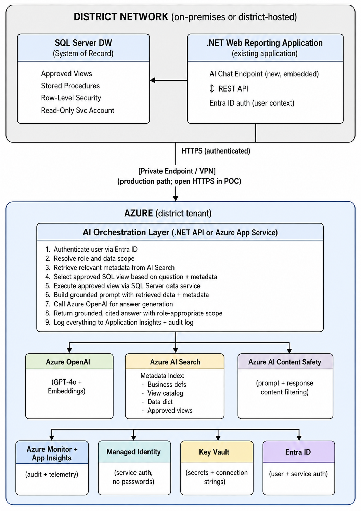

# Module 01 — Course Orientation and the 80/20 Roadmap

**Week:** 1 of 8
**Estimated time:** ~2 hours (reading + architecture review) + lab
**Lab:** `lab-01a-environment-setup.md`

## Learning Objectives

By the end of this module you will be able to:

1. State the single target use case this course builds toward and explain why it is scoped narrowly
2. Identify the 20% of Azure AI capabilities that deliver 80% of proof-of-concept value for district analytics
3. Describe the target architecture at the component level and trace a single user question end-to-end through it
4. Map existing district technical assets (SQL Server, .NET web reporting app, internal staff roles) to specific Azure AI integration points
5. Explain the four constraints that drive every major architecture decision in this course
6. Set up the course lab environment and verify connectivity to the synthetic K-12 database

## 1. Why This Course Is Scoped the Way It Is

Azure AI is a large and rapidly expanding service family. A broad survey of everything Azure AI can do would require months and would leave you knowing a little about a lot but not enough to build anything real for the district.

This course applies the 80/20 principle differently: it asks **what is the smallest set of Azure AI knowledge that lets this specific team build a secure, useful, evaluable proof of concept for a district analytics chat assistant?**

The answer is a focused stack of five to seven Azure services, a small number of integration patterns, and a set of governance practices — all applied to realistic K-12 district data scenarios.

**What is out of scope (and why):**

| Out of Scope                                   | Reason                                                                                     |
| ---------------------------------------------- | ------------------------------------------------------------------------------------------ |
| Azure Computer Vision, Speech, Form Recognizer | The district assistant is text-only analytics                                              |
| Azure Machine Learning training pipelines      | No custom model training in the POC; use pre-trained models via Azure OpenAI               |
| Power BI integration                           | The district uses its own web reporting application                                        |
| Generic customer-service bot patterns          | District analytics requires role-aware data access, not FAQ lookup                         |
| Azure Synapse, Fabric, Databricks              | SQL Server is the system of record; no data migration in scope                             |
| AI model fine-tuning                           | RAG over approved data is the correct first approach; fine-tuning adds complexity and cost |
| Broad ML theory                                | Not needed to evaluate, build, or govern the district assistant                            |

**What is in scope:**

The in-scope services and concepts are listed in Section 3 of this module. Every one of them has a direct, concrete role in the district analytics assistant architecture.

## 2. The Target Use Case (One Sentence)

> A secure, role-aware chat assistant embedded in the district's existing web reporting application that answers natural-language analytics questions from teachers, school administrators, and district administrators using approved queries against the district's in-house SQL Server data warehouse, with grounded answers, citations, and audit trails.

Every architecture decision in this course is tested against this sentence. If a technology or pattern does not serve this use case, it is not in scope.

## 3. The 80/20 Azure AI Stack for This Use Case

The following table maps the district assistant's functional requirements to the minimum Azure AI capabilities needed to satisfy them. Learning these deeply is more valuable than knowing everything shallowly.

| District Requirement                            | Primary Azure Capability                         | Secondary                             |
| ----------------------------------------------- | ------------------------------------------------ | ------------------------------------- |
| Natural-language question answering             | Azure OpenAI (GPT-4o or GPT-4o-mini)             | —                                    |
| Grounding answers in approved district metadata | Azure AI Search (vector + hybrid retrieval)      | —                                    |
| Embedding generation for semantic retrieval     | Azure OpenAI Embeddings (text-embedding-3-small) | —                                    |
| Safe, auditable data access                     | SQL Server approved views + stored procedures    | Azure SQL row-level security patterns |
| Prompt and response content safety              | Azure AI Content Safety                          | Azure OpenAI built-in filters         |
| Authentication for all service calls            | Microsoft Entra ID + Managed Identities          | Azure Key Vault                       |
| Secret management                               | Azure Key Vault                                  | —                                    |
| Backend API orchestration                       | .NET 8 minimal API (Azure.AI.OpenAI SDK)         | Python prototyping                    |
| Monitoring, logging, and audit                  | Azure Monitor + Application Insights             | Structured logging in .NET            |
| Private networking (production path)            | Private Endpoints / VPN concepts                 | —                                    |
| Responsible AI governance                       | Azure AI Foundry Responsible AI tools            | Manual evaluation test sets           |

**The 20% you do NOT need to build a district analytics POC:**

- Custom embedding model training
- Custom model fine-tuning
- Azure Machine Learning pipelines
- Azure AI Foundry agent frameworks (useful later; not required for the POC)
- Azure Cognitive Services (Vision, Speech, Language) beyond Content Safety
- Complex multi-agent orchestration

## 4. The Four Constraints That Drive All Design Decisions

Every key decision in this course — which service to use, which integration pattern to choose, which access control approach to apply — flows from four constraints. Understanding these prevents wasted design effort.

### Constraint 1: Data Stays In-House

The district's student data lives in an on-premises (or internally hosted) SQL Server. It does not migrate to Azure during the POC.

**Implications:**

- Azure AI services call back to district SQL Server through a secure API layer — they do not hold district data natively (except for temporary context in prompt windows)
- The AI pipeline is in Azure; the data warehouse is on-premises
- Private networking, service identities, and approved data access patterns are not optional extras — they are the architecture

### Constraint 2: FERPA Applies to Student Data in AI Systems

FERPA (Family Educational Rights and Privacy Act) applies when AI systems access student education records. This is not a legal discussion — it is a technical design requirement.

**Implications for the AI pipeline:**

- Student education records may not be sent to Azure OpenAI without appropriate controls and agreements in place
- The least-privilege principle applies to every component that touches student data
- Prompts and retrieved data that contain student records must be logged, controlled, and not retained beyond operational need
- Role-based access must be enforced at the data layer, not just the UI layer
- The AI assistant must not return information about identified students to users who are not authorized for that student

> **Practical course approach:** All labs use synthetic data. The course teaches the patterns that apply to real student data, but labs never use real student records. The security and governance modules (Week 7) cover the formal requirements that must be met before production deployment.

### Constraint 3: The Existing .NET Stack Is the Integration Point

The district already has a .NET-based web reporting application. The AI assistant is embedded in that application — it is not a separate product.

**Implications:**

- .NET is the primary implementation language for the orchestration API
- Python is used for prototyping, evaluation, and data preparation scripts
- The architecture must support adding an AI chat endpoint to an existing .NET web application without a full rewrite
- Authentication flows through the existing Entra ID tenant

### Constraint 4: The AI Must Not Generate Unrestricted SQL Against Production

This is the most common mistake teams make when building AI analytics assistants. Allowing an LLM to write arbitrary SQL against a production database creates serious risks:

- Data exfiltration through prompt manipulation
- Expensive or destructive queries
- Bypass of row-level security
- Audit gaps (no record of what was queried)
- FERPA violations from uncontrolled data retrieval

**The safe pattern (taught throughout this course):**
The AI assistant selects from a catalog of pre-approved SQL views and stored procedures. It does not write SQL. The approved views are the only data access surface the AI pipeline can touch.

Direct AI-generated SQL is explored in controlled labs using synthetic data only, so you can understand the risk — not because it is acceptable in production.

## 5. Target Architecture Overview

The following describes the target architecture for the district analytics assistant. This architecture is built incrementally over the eight-week course.

### Architecture Description



### Tracing One Question End-to-End

**User:** A school principal sends the question: *"Which grade levels at my school are below expected performance in reading this semester?"*

**Step 1 — Authentication:**
The web application passes the user's Entra ID token to the AI chat endpoint. The orchestration layer resolves the user's role (school_admin) and their school assignment (School ID: 042 — Palmetto Ridge High).

**Step 2 — Metadata Retrieval (AI Search):**
The orchestration layer embeds the question and queries the Azure AI Search metadata index. It retrieves: the business definition for "expected performance in reading" (tied to a district benchmark formula), the approved view `vw_ReadingPerformanceByGradeAndSchool`, and a note that this view filters by school when role = school_admin.

**Step 3 — Data Access (Approved View):**
The orchestration layer calls the approved SQL view with parameterized inputs: `@SchoolID = 042`, `@RoleScope = 'school_admin'`, `@Semester = 'S1-2025-26'`. The read-only service account executes this against the DW. The view's row-level security ensures only School 042 data is returned. Result: a table of grade levels with actual vs. expected reading proficiency rates.

**Step 4 — Prompt Construction:**
The orchestration layer builds a grounded prompt that includes the question, the user's role and school context, the retrieved metadata definitions, and the query result data.

**Step 5 — Answer Generation (Azure OpenAI):**
Azure OpenAI generates an answer that: (a) reports the specific grade levels below benchmark, (b) cites `vw_ReadingPerformanceByGradeAndSchool` and the semester as sources, (c) notes the benchmark definition used, (d) flags any data quality issues in the retrieved data, and (e) classifies the answer as descriptive + diagnostic rather than prescriptive.

**Step 6 — Safety Check:**
Azure AI Content Safety reviews the response before it is returned.

**Step 7 — Logging:**
The prompt, retrieved data hash, response, user role, school scope, token counts, and latency are written to the structured audit log in Application Insights.

**Step 8 — Response:**
The web application displays the grounded, cited answer to the school principal with source attribution.

## 6. Course Lab Environment

The hands-on labs throughout this course use:

- **Synthetic K-12 SQL Server database** — fictional district data modeled on realistic K-12 DW domains (schema in `resources/synthetic-schema.md`). No real student data is ever used.
- **Azure resource group** — a dedicated resource group in a dev/sandbox subscription for all Azure resources provisioned during the course
- **Azure OpenAI resource** — a GPT-4o-mini deployment (sufficient for labs; lower cost than GPT-4o) and a text-embedding-3-small deployment
- **Azure AI Search resource** — Basic tier sufficient for lab indexes
- **.NET 8 project** — a minimal API project scaffolded in Week 5 and used through the capstone
- **Python environment** — a virtual environment with `openai`, `pyodbc`, `pandas`, and `azure-search-documents`

### Lab Environment Architecture (POC Simplifications)

The course labs make intentional simplifications relative to a production deployment:

| Production Requirement                   | POC Lab Approach                         | Week Full Pattern Is Taught |
| ---------------------------------------- | ---------------------------------------- | --------------------------- |
| Private endpoints for all Azure services | Open public endpoints (dev sandbox only) | Week 8                      |
| Managed Identity for all auth            | API key in Key Vault for some labs       | Week 5                      |
| Production SQL Server on-premises        | Local SQL Server Express or Azure SQL    | Week 1                      |
| District Entra ID tenant                 | Simulated role injection in headers      | Week 6                      |
| Content Safety on every request          | Selective lab testing                    | Week 7                      |
| Full audit logging pipeline              | Basic Application Insights logging       | Week 8                      |

> These simplifications exist to reduce environment friction in the lab setting. Each module explicitly identifies the POC simplification and the production requirement it replaces. **Never apply POC-only patterns to production.**

## 7. Key Concepts Summary

| Concept                         | What It Means in This Course                                                                                                                     |
| ------------------------------- | ------------------------------------------------------------------------------------------------------------------------------------------------ |
| **80/20 principle**       | Focus on the smallest set of Azure AI capabilities that delivers the POC; defer everything else                                                  |
| **Grounded answer**       | An answer that is derived from retrieved approved data, not from the model's internal training weights                                           |
| **Approved view catalog** | A curated set of pre-built SQL views that the AI can select from; the AI never writes raw SQL in production                                      |
| **Metadata index**        | An Azure AI Search index containing business definitions, data dictionary entries, and view catalog metadata — the AI's "knowledge of the data" |
| **RAG**                   | Retrieval-Augmented Generation — retrieve relevant context first, then generate the answer using that context                                   |
| **Role scope**            | The data scope the user's role entitles them to — teacher (own students), school admin (own school), district admin (all schools)               |
| **Citation requirement**  | Every factual answer must identify the source SQL view, time period, and any relevant definitions used                                           |
| **FERPA boundary**        | The design rule that prevents student education records from being exposed through AI responses to unauthorized users                            |
| **POC vs. production**    | The POC proves the concept and evaluates feasibility; production requires full governance, approval gates, and security hardening                |

## 8. Architecture Decision: Why RAG Over Fine-Tuning

One of the most common questions teams ask when starting an AI analytics project is whether to fine-tune a model on district data or use RAG. This is a critical early decision.

| Dimension          | Fine-Tuning                                        | RAG (This Course)                                                  |
| ------------------ | -------------------------------------------------- | ------------------------------------------------------------------ |
| Data currency      | Stale — model must be retrained when data changes | Live — retrieval pulls current approved data at query time        |
| Cost               | High — retraining is expensive and ongoing        | Lower — retrieval + generation per query                          |
| Privacy risk       | High — student data baked into model weights      | Controlled — data accessed only via approved views at query time  |
| Answer grounding   | Cannot cite sources reliably                       | Can cite exact source views, periods, and definitions              |
| Control            | Difficult to update or audit                       | Catalog and views are fully controlled by district technical staff |
| Time to POC        | Months                                             | Weeks                                                              |
| FERPA implications | Very complex — weights may memorize PII           | Manageable with approved view access controls                      |

**Decision: RAG with approved views and metadata retrieval is the correct architecture for this use case.** Fine-tuning is out of scope for the course and is not recommended for the POC or initial production deployment.

## 9. Architecture Decision: Why Approved Views Over AI-Generated SQL

The second critical early decision: allow the AI to write SQL, or restrict it to a catalog of approved queries?

| Dimension          | AI-Generated SQL                                  | Approved Views (This Course)              |
| ------------------ | ------------------------------------------------- | ----------------------------------------- |
| Security           | High risk — prompt injection can exfiltrate data | Controlled — fixed query surfaces only   |
| Auditability       | Hard to audit unknown queries                     | Every view is known, reviewed, and logged |
| Row-level security | May be bypassed through creative SQL              | Enforced within the view definition       |
| FERPA compliance   | Extremely difficult to ensure                     | Manageable with view-level controls       |
| Performance        | Unpredictable                                     | Views can be optimized and indexed        |
| Correctness        | High hallucination risk on schema details         | Views encode correct business logic       |
| Maintenance        | Uncontrolled surface area                         | Explicit change management                |

**Decision: The AI selects from a catalog of approved views; it does not generate SQL in production.** AI-generated SQL is explored in a controlled lab environment on synthetic data only.

## 10. Practical Implementation Guidance

### Setting Up Your Thinking About This Course

Before diving into Azure services, internalize this priority order for every decision you make during the course:

1. **Does this protect FERPA-covered student data?** If not, redesign.
2. **Is this auditable?** Every query, prompt, and response must be logged.
3. **Is this grounded?** Answers must cite approved sources.
4. **Is this role-appropriate?** Users see only what their role entitles them to.
5. **Is this maintainable?** The district technical team must be able to update, debug, and extend it.
6. **Is this cost-reasonable?** AI costs at scale must be estimated and approved.

### The Component You Build Each Week

| Week     | Component Added                                |
| -------- | ---------------------------------------------- |
| 1        | Environment setup; conceptual architecture     |
| 2        | Azure OpenAI call + prompt engineering         |
| 3        | Azure AI Search retrieval + basic RAG pipeline |
| 4        | Approved SQL views + metadata catalog          |
| 5        | .NET orchestration API + Python prototype      |
| 6        | Role-aware scoping + analytics scenarios       |
| 7        | Privacy review + evaluation test set           |
| 8        | Monitoring + production checklist              |
| Capstone | Full integrated prototype                      |

Each week's lab connects to the weeks before it. By Week 5, you have a working end-to-end prototype. Weeks 6–8 harden, evaluate, and plan it for production consideration.

## 11. .NET Implementation Notes

This course targets **.NET 10** as the primary runtime. All code samples are written for `net10.0`. They are compatible with **.NET 8** (`net8.0`) without modification — only the `<TargetFramework>` element in the `.csproj` file differs.

> **⚠️ .NET 6 is End of Life** (November 2024). Do not use .NET 6 for new implementations. If your district still runs .NET 6 services, migrate to .NET 8 or .NET 10 before applying these patterns. Security patches are no longer issued for .NET 6.

The primary SDK packages used throughout the course:

```xml
<Project Sdk="Microsoft.NET.Sdk.Web">
  <PropertyGroup>
    <!-- .NET 10 primary target -->
    <TargetFramework>net10.0</TargetFramework>
    <!-- For .NET 8 compatibility: change to net8.0 — all packages below work unchanged -->
    <Nullable>enable</Nullable>
    <ImplicitUsings>enable</ImplicitUsings>
  </PropertyGroup>
  <ItemGroup>
    <!-- Azure OpenAI (chat completions, embeddings) -->
    <PackageReference Include="Azure.AI.OpenAI" Version="2.*" />

    <!-- Azure AI Search (metadata and knowledge retrieval) -->
    <PackageReference Include="Azure.Search.Documents" Version="11.*" />

    <!-- Azure Key Vault (secret management) -->
    <PackageReference Include="Azure.Security.KeyVault.Secrets" Version="4.*" />

    <!-- Azure Identity (DefaultAzureCredential, Managed Identity) -->
    <PackageReference Include="Azure.Identity" Version="1.*" />

    <!-- SQL Server data access -->
    <PackageReference Include="Microsoft.Data.SqlClient" Version="5.*" />
    <PackageReference Include="Dapper" Version="2.*" />

    <!-- OpenTelemetry + Azure Monitor (preferred in .NET 10) -->
    <PackageReference Include="Azure.Monitor.OpenTelemetry.AspNetCore" Version="1.*" />
    <!-- OR: classic Application Insights (also works on .NET 10) -->
    <!-- <PackageReference Include="Microsoft.ApplicationInsights.AspNetCore" Version="2.*" /> -->
  </ItemGroup>
</Project>
```

> **Verify before use:** NuGet package versions evolve rapidly in the Azure SDK. Always check [NuGet.org](https://www.nuget.org) and the official [Azure SDK for .NET releases](https://azure.github.io/azure-sdk/releases/latest/dotnet.html) for the latest stable versions before implementing. Package names above are stable; minor/patch versions should be verified at implementation time.

The course labs provide complete, runnable .NET 10 code samples. Adapt them to the district's project structure and naming conventions. Where a pattern differs between .NET 10 and .NET 8, both versions are shown.

## 12. Python Notes

Python is used in this course for:

- Rapid prototyping of RAG pipelines (Week 5)
- Evaluation scripts (Week 7)
- Data preparation and synthetic data generation (supporting role)

Primary Python packages:

```bash
pip install openai>=1.0.0          # Azure OpenAI Python SDK
pip install azure-search-documents  # Azure AI Search
pip install azure-identity          # Managed Identity and credential chains
pip install pyodbc                  # SQL Server connectivity
pip install pandas                  # Data manipulation for labs
pip install jupyter                 # Notebook environment for prototype labs
```

Python notebooks are provided in `lab-05b-python-prototype.md`. They are annotated for learners who are comfortable with Python but are not Python experts.

## Hands-On Lab: Lab 01a — Environment Setup

**File:** `week-01/lab-01a-environment-setup.md`

**Objective:** Provision all Azure resources and local tools needed for the course, and verify connectivity to the synthetic K-12 SQL Server database.

**Lab Summary:**

1. Create an Azure resource group (`rg-district-ai-poc`)
2. Create an Azure OpenAI resource in a supported region
3. Deploy a `gpt-4o-mini` model and a `text-embedding-3-small` model
4. Create an Azure AI Search resource (Basic tier)
5. Create an Azure Key Vault and store the OpenAI API key
6. Set up the synthetic K-12 SQL Server database (schema from `resources/synthetic-schema.md`)
7. Install .NET 8 SDK, Python 3.11+, Azure CLI, and VS Code
8. Clone or create the course project structure
9. Verify: make a test call to Azure OpenAI from both .NET and Python
10. Verify: connect to the synthetic SQL Server database and run a test query

Completion check: You should be able to run `dotnet run` on a minimal test project and receive a valid chat completion response from Azure OpenAI.

> **Do the lab before proceeding to Module 02.** Week 2 builds directly on the environment set up here.

## Common Pitfalls

| Pitfall                                               | How to Avoid It                                                                           |
| ----------------------------------------------------- | ----------------------------------------------------------------------------------------- |
| Using a production Azure tenant/subscription for labs | Use a dedicated dev/sandbox subscription; isolate all lab resources in one resource group |
| Hardcoding API keys in source code                    | Keys go in Key Vault or environment variables from the start, even in labs                |
| Skipping the synthetic schema setup                   | All labs depend on it; spend the time in Week 1                                           |
| Conflating POC patterns with production requirements  | Each module flags POC simplifications explicitly — read them                             |
| Assuming the LLM knows district data                  | It doesn't; the metadata catalog and retrieved context are what make answers accurate     |
| Treating all Azure AI services as equally relevant    | Follow the 80/20 stack; resist the urge to evaluate every available service               |

## Security and Privacy Considerations

At this orientation stage, the key security principles to internalize are:

- **Never use real student data in labs.** All labs use synthetic data from `resources/synthetic-schema.md`.
- **Treat API keys as secrets from day one.** Store them in environment variables or Key Vault, not in code or version control.
- **Keep lab Azure resources isolated.** Use a separate resource group that can be deleted after the course without affecting any production resources.
- **Understand that prompts are not private by default.** Azure OpenAI does not use your prompts to train models (as of the Azure managed service agreement), but you should still treat prompt design as a security boundary.
- **FERPA applies when you go to production.** The course teaches the patterns; formal legal and compliance review is required before connecting real student data.

## Reflection Questions

Take 10–15 minutes to write brief answers to these questions before moving to Module 02:

1. Which district analytics questions do you hear most often from teachers, school administrators, and district administrators? List five. Which of those would be most valuable to answer through an AI assistant?
2. What are the biggest data access risks you can imagine if an AI assistant had unrestricted access to the district SQL Server? Be specific about the types of questions or manipulations that could go wrong.
3. The course architecture keeps student data in SQL Server on-premises and only sends query results (in aggregate or appropriately scoped) to Azure OpenAI. What governance questions would your district's leadership or legal team most likely ask about this arrangement?
4. Think about the three user roles — teacher, school administrator, district administrator. For each role, what is one analytics question they ask regularly, and what is one type of data they should not be able to access through the AI assistant?
5. What would "success" look like for a proof of concept at your district? What would you need to demonstrate to get approval for a pilot?

## Assessment Task

**Before moving to Module 02, complete the following:**

**Task 1 — Environment Verification:** Complete Lab 01a and document the outcome. Confirm you can make a successful Azure OpenAI API call and connect to the synthetic SQL Server database.

**Task 2 — Architecture Sketch:** Draw or describe (in text or a simple diagram) how you imagine the district analytics assistant fitting into the existing web reporting application. Identify: where the chat interface appears, where the AI orchestration code runs, how it connects to SQL Server, and what user authentication looks like. You do not need to be technically precise — this is a starting-point sketch you will refine through the course.

**Task 3 — Constraint Reflection:** Write one paragraph for each of the four constraints in Section 4 (Data Stays In-House, FERPA Applies, Existing .NET Stack, No Unrestricted SQL), explaining in your own words what it means for the district's specific situation.

These tasks do not need to be submitted formally — use them as personal checkpoints to ensure you have internalized the course framing before proceeding.

## References to Verify Before Implementation

The following references are current as of mid-2026. Azure AI evolves rapidly — verify these links before implementing any specific SDK call or service configuration.

### Primary References (Microsoft Official)

| Resource                                | URL                                                                                                           |
| --------------------------------------- | ------------------------------------------------------------------------------------------------------------- |
| Azure OpenAI Service overview           | https://learn.microsoft.com/en-us/azure/ai-services/openai/overview                                           |
| Azure OpenAI models and capabilities    | https://learn.microsoft.com/en-us/azure/ai-services/openai/concepts/models                                    |
| Azure AI Search overview                | https://learn.microsoft.com/en-us/azure/search/search-what-is-azure-search                                    |
| Azure AI Foundry overview               | https://learn.microsoft.com/en-us/azure/ai-foundry/what-is-ai-foundry                                         |
| Azure AI Content Safety overview        | https://learn.microsoft.com/en-us/azure/ai-services/content-safety/overview                                   |
| Microsoft Entra ID overview             | https://learn.microsoft.com/en-us/entra/fundamentals/whatis                                                   |
| Azure Key Vault overview                | https://learn.microsoft.com/en-us/azure/key-vault/general/overview                                            |
| Azure Managed Identities                | https://learn.microsoft.com/en-us/entra/identity/managed-identities-azure-resources/overview                  |
| Azure OpenAI .NET SDK (Azure.AI.OpenAI) | https://learn.microsoft.com/en-us/dotnet/api/overview/azure/ai.openai-readme                                  |
| Azure SDK for .NET — all packages      | https://azure.github.io/azure-sdk-for-net/                                                                    |
| RAG pattern overview (Microsoft)        | https://learn.microsoft.com/en-us/azure/architecture/ai-ml/guide/rag/rag-solution-design-and-evaluation-guide |
| Responsible AI principles (Microsoft)   | https://learn.microsoft.com/en-us/azure/machine-learning/concept-responsible-ai                               |
| Azure OpenAI data privacy and security  | https://learn.microsoft.com/en-us/legal/cognitive-services/openai/data-privacy                                |

### FERPA Reference

| Resource                                | URL                                     |
| --------------------------------------- | --------------------------------------- |
| FERPA overview (U.S. Dept of Education) | https://studentprivacy.ed.gov/ferpa     |
| PTAC — Student Privacy and Technology  | https://studentprivacy.ed.gov/resources |

### Supplemental (Verify Currency Before Use)

| Resource                                  | Note                                                                                                                 |
| ----------------------------------------- | -------------------------------------------------------------------------------------------------------------------- |
| Azure AI Search — vector search concepts | Verify latest index schema and embedding integration approach in Microsoft Docs                                      |
| Azure OpenAI pricing                      | Verify current token pricing at https://azure.microsoft.com/en-us/pricing/details/cognitive-services/openai-service/ |
| .NET 8 Minimal API documentation          | https://learn.microsoft.com/en-us/aspnet/core/fundamentals/minimal-apis                                              |

> **Implementation note:** Azure AI service names, SDK namespaces, and portal workflows change. When any guidance in this course conflicts with current Microsoft documentation, the Microsoft documentation takes precedence. Always verify SDK package versions, API endpoint paths, and authentication patterns against the official docs at implementation time.

*Next: Module 02 — Azure AI Services for District Analytics (`week-01/module-02-azure-ai-landscape.md`)*
